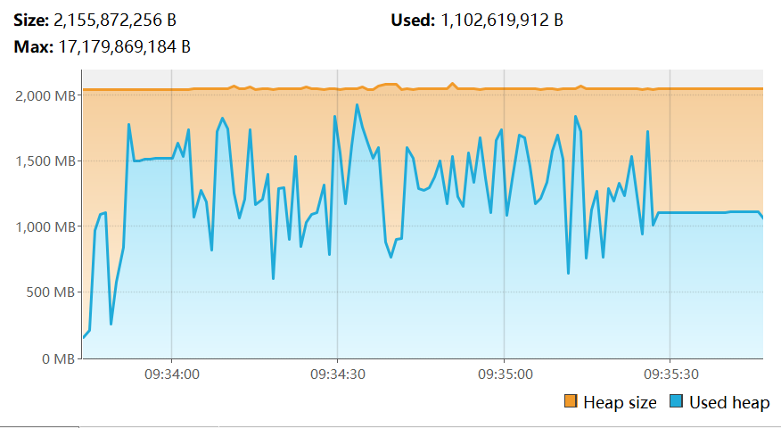
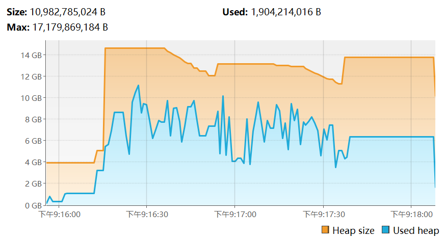
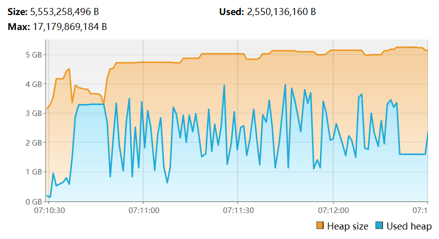

# 测试环境
| JDK        | Liberica LTS 25      |
| :--------- | :------------------- |
| 服务端核心 | Fabric 1.21.1        |
| 关键MOD    | `Lithosphere` `C2ME` |

# 负载方式
1. 删除存档中的region文件夹
2. 启动服务端
3. 运行/chunky radius 1024

# 运行统计
| 记录项     | G1GC   | ZGC    | SGCM  |
| :--------- | :----- | :----- | :---- |
| chunky用时 | 1m26s  | 1m26s  | 1m32s |
| 内存峰值   | 2.1G   | 15.5G  | 5.5G  |
| STW时间    | 2~17ms | 0.07ms | 0.3ms |

# 内存水位
- ## G1GC
  
- ## ZGC
  
- ## SGCM
  
