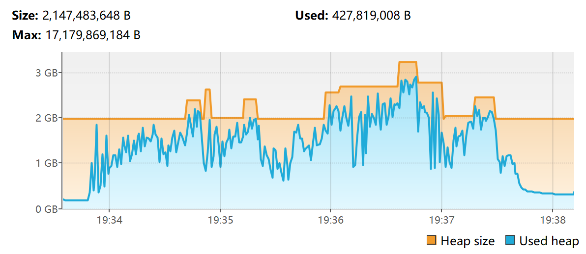
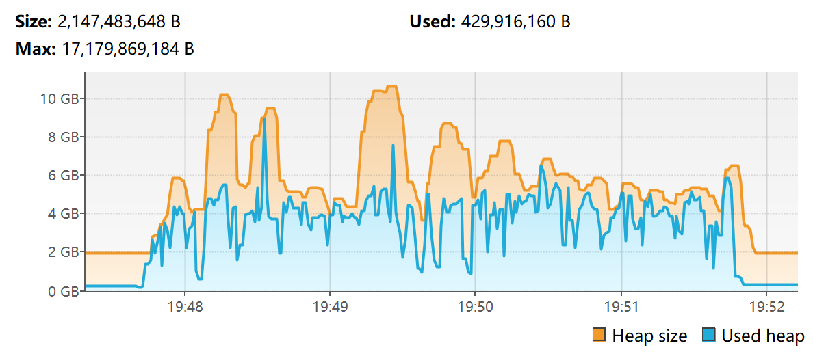

## 测试环境
| 内存分配   | -Xms2G -Xmx16G |
| :--------- | :------------- |
| JDK        | ZuluJDK 25     |
| 服务端核心 | Fabric 1.21.1  |
| 关键MOD    | Lithosphere    |

## 负载方式
1. 删除存档中的region文件夹
2. 启动服务端
3. 运行/chunky radius 1000

## 数据对比
- OMCF G1GC  
  
- OMCF G1GCC  
  
- OMCF ZGC  
  
- OMCF ZGCC  
  
