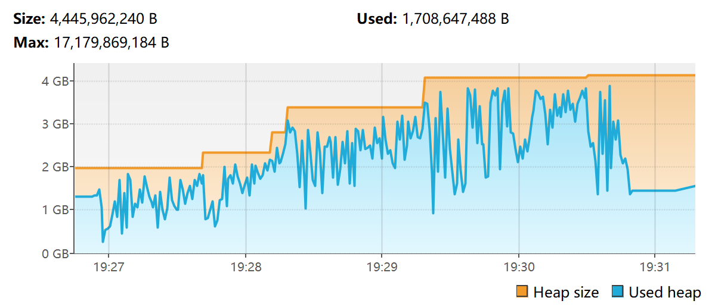
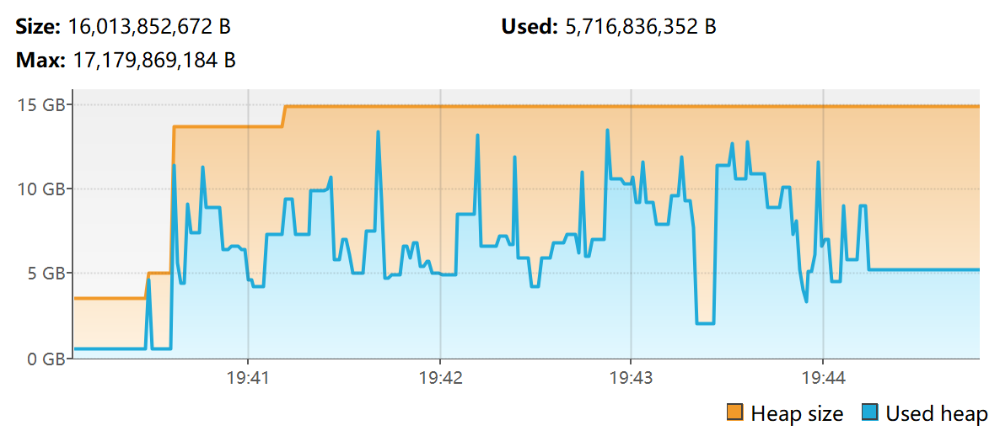
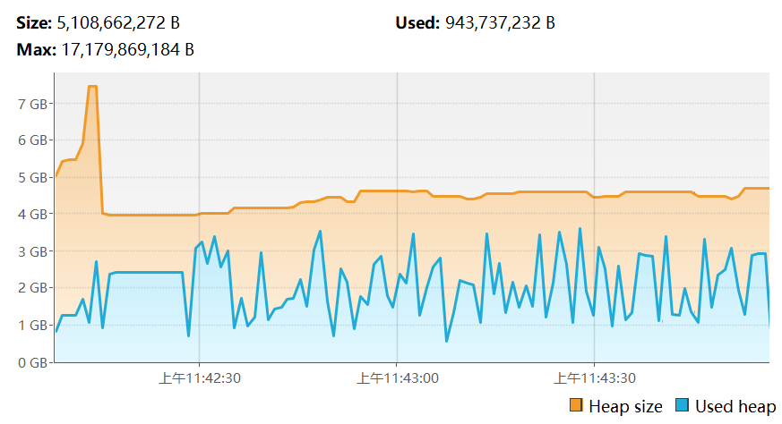

# 测试环境
| 内存分配   | -Xms4G -Xmx16G         |
| :--------- | :--------------------- |
| JDK        | Liberica LTS 25        |
| 服务端核心 | Fabric 1.21.1          |
| 关键MOD    | `Lithosphere` & `C2ME` |

# 负载方式
1. 删除存档中的region文件夹
2. 启动服务端
3. 运行/chunky radius 1024

# 运行统计
| 记录项     | G1GC   | ZGC    | SGC   |
| :--------- | :----- | :----- | :---- |
| chunky用时 | 1m16s  | 1m28s  | 1m26s |
| 内存峰值   | 4G     | 14G    | 5G    |
| STW时间    | 1~13ms | 0.05ms | 0.3ms |

# 内存水位
- ## G1GC
  
- ## ZGC
  
- ## SGC
  
