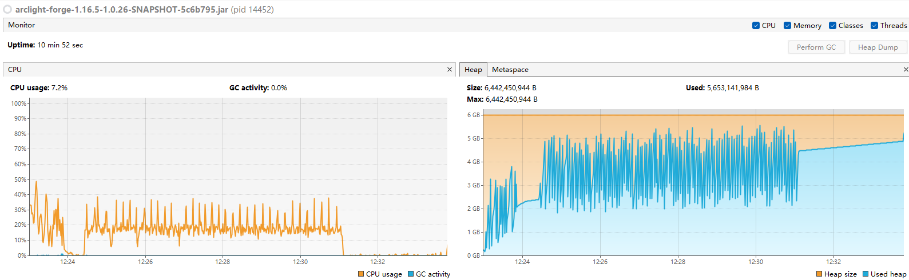
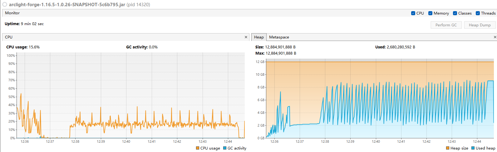
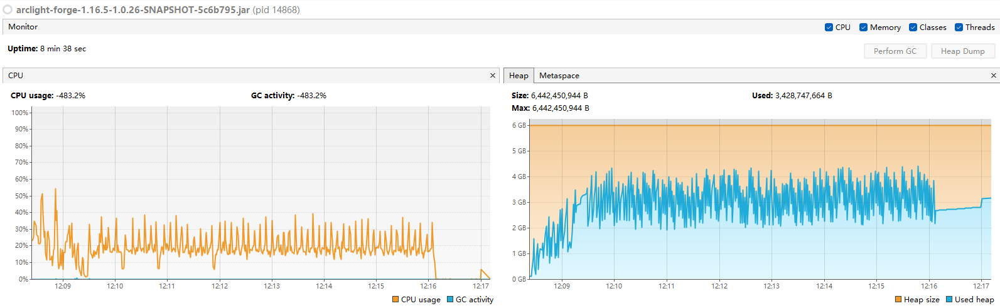
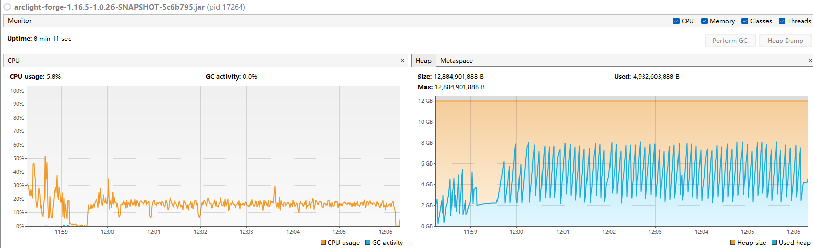
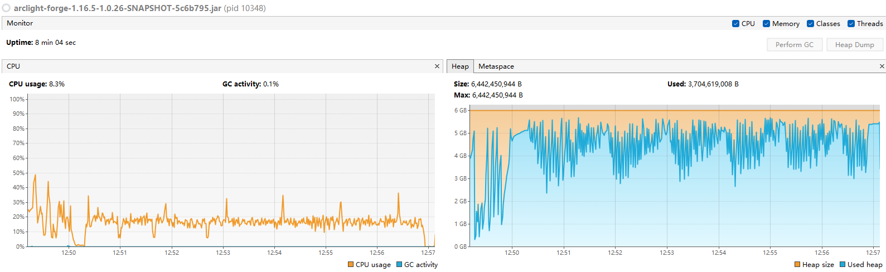
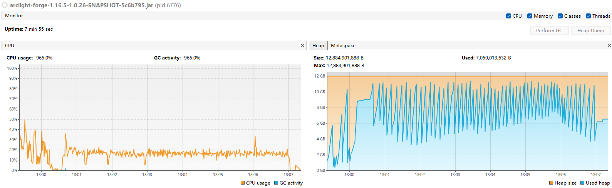

# 测试环境
| CPU        | 8C16T @4.05GHZ  |
| :--------- | :-------------- |
| JDK        | Liberica JDK 21 |
| 服务端核心 | Arclight 1.16.5 |
| MOD数      | 200             |
| 关键MOD    | TerraForged     |

负载方式：  
1.删除存档中的region文件夹  
2.启动服务器生成初始区块后并关闭  
3.再启动服务器  
4.运行/chunky radius 1000  

# 数据对比
- JVM默认
    | 分配内存 | CPU曲线趋势 | GC总次数 | GC总时间 | GC平均时间 |
    | :------- | :---------- | :------- | :------- | :--------- |
    | 6G       | 30%         | 131      | 4.0s     | 30ms       |
    | 12G      | 25%         | 82       | 3.2s     | 39ms       |

- Aikar's Flags
    | 分配内存 | CPU曲线趋势 | GC总次数 | GC总时间 | GC平均时间 |
    | :------- | :---------- | :------- | :------- | :--------- |
    | 6G       | 30%         | 192      | 4.0s     | 20ms       |
    | 12G      | 20%         | 76       | 2.0s     | 26ms       |

- 我的GC
    | 分配内存 | CPU曲线趋势 | GC总次数 | GC总时间 | GC平均时间 |
    | :------- | :---------- | :------- | :------- | :--------- |
    | 6G       | 20%         | 217      | 3.8s     | 17ms       |
    | 12G      | 20%         | 75       | 2.0s     | 26ms       |

